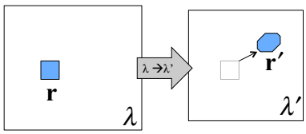

Welcome to the mapped-averaging project
=========================================

This project is a Python implementation of the [mapped-averaging] (https://pubs.acs.org/doi/abs/10.1021/acs.jctc.6b00018) method for precise estimation of ensemble averages from molecular simulation outputs.

{width=250px}
