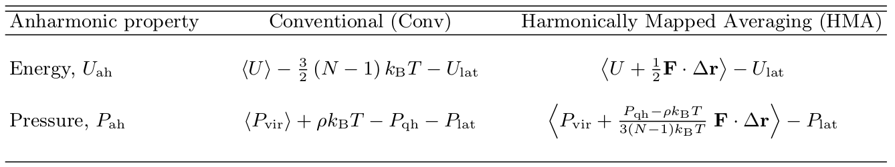

.. _application_crystal:

Application to Crystals
#########################
For crystalline systems, a reference for mapping can be chosen to be non-interacting harmonic system, or Einstein crystal (EC). Using the offset from the lattice sites (i.e., :math:`r-r_{\rm lattice}`) to represent our coordinate :math:`x`, the potential energy for each dof is then given by

.. math::
   u^{\rm ref} = \alpha(\lambda) x^2
   
hence, the free energy is given by

.. math::
   a^{\rm ref} = \frac{1}{2} \ln \left(\alpha(\lambda)/\pi\right)
   
Accordingly, :math:`f^{\rm ref} = -2 \alpha(\lambda) x\;` , :math:`\; I=- \alpha(\lambda)  x^2`, and :math:`g=(\partial_{\nu}\alpha)\left[ x^2 - 1/2\alpha\right]`. Requiring the mapping velocity to vanish when atoms are at their lattice sites; i.e., :math:`{\dot x}^{\nu} =0` at :math:`x = 0`, the solution of the velocity mapping equation is reduced to

.. math::
   {\dot x}^{\nu} &=& \; e^{-I(x)} \int_{0}^{x} g \; e^{I(x)}{\rm d}x \\
                  &=& \; e^{\alpha(\lambda)  x^2} \int_{0}^{x} g \; e^{-\alpha(\lambda)  x^2}{\rm d}x \\
                  &=& \; - \frac{\partial_{\nu} \alpha}{2 \alpha} \; x 

We will now consider two cases: temperature and volume free energy derivative; or energy and pressure, consequently. Note that all energy quantities (and its derivatives, like forces) are multiplied by :math:`\beta`; hence, the force constant :math:`\alpha \rightarrow \beta\alpha`, where :math:`\alpha` is now temperature independent.

- **case 1:** :math:`\nu = \beta`

.. math::
   \partial_{\beta} (\beta\alpha) = \alpha

hence,

.. math::
   {\dot x}^{\beta} = -\frac{1}{2\beta} \; x

- **case 2:** :math:`\nu = V`

Here, we need to use the :math:`L`-scaled coordinates (i.e., :math:`x\rightarrow x/L`); hence :math:`\alpha \rightarrow L^2 \beta\alpha = V^{2/3}\beta\alpha(V)`

.. math::
   {\dot x}^{V} &=& - \frac{1}{2} \frac{\partial_{\nu} (V^{2/3}\alpha(V))}{V^{2/3}\alpha(V)} \; x  \\
   &=& \left(-\frac{1}{2} \frac{\partial_{V}\alpha(V)}{\alpha(V)} - \frac{1}{3V}\right) \; x \\ 
   &=& \left(\beta\, p^{\rm harm}- \frac{1}{3V}\right) \; x  

Where :math:`p^{\rm harm}` is the harmonic pressure per each dof. For more details you can refer to our `PRE <https://journals.aps.org/pre/abstract/10.1103/PhysRevE.92.043303>`_ and `JCTC <https://pubs.acs.org/doi/abs/10.1021/acs.jctc.6b00018>`_ work.

Anharmonic energy
====================

**Conventional (no mapping):**

.. math::
   U^{\rm ah} = \left< U \right> - \frac{d(N-1)}{2} k_{\rm B} T - U^{\rm lat} 

**Mapped averaging (Einstein crystal reference):**

.. math::
   U^{\rm ah} =  \left< U + \frac{1}{2} {\bf F}\cdot\Delta{\bf r}\right> - U^{\rm lat} 

|

Anharmonic pressure
====================

**Conventional (uniform scaling):**

.. math::
   P^{\rm ah} = \left< P^{\rm vir} \right> + \rho k_{\rm B}T - P^{\rm qh} - P^{\rm lat} 

**Mapped averaging (Einstein crystal reference):**

.. math::
   P^{\rm ah} = \left< P^{\rm vir} + c \; {\bf F}\cdot\Delta{\bf r} \right>  - P^{\rm lat} 

where :math:`c` is a constant and given by, :math:`c = \frac{\beta P^{\rm qh} - \rho}{d\left(N-1\right)}`

The formulas for both anharmonic energy and pressure are summarized in :numref:`Figure %s <pyhma_eqs>`.

.. _pyhma_eqs:

   Conventional and HMA formulas for anharmonic energy and pressure.

Equivalence of Conv and HMA
============================

The equivalence between both conventional and mapped-averaging expressions can be easily seen by recognizing this equality for crystalline systems:

.. math::
   \left<{\bf F}\cdot\Delta{\bf r} \right> = - d\left(N-1\right) k_{\rm B} T 

Plugging this expression into the HMA expressions yields the conventional average expression.

**Proof:**

The general expression for the configurational partition function is given by:

.. math::
   Q = \int e^{-\beta U} {\rm d} {\bf x} 

For crystalline systems, we use :math:`\Delta {\bf x} \equiv {\bf x} - {\bf x}^{\rm lat}`

.. math::
   Q = \int_{\rm WS} e^{-\beta U} \, {\rm d}^{dN}\Delta x 

Where the integration is carried out withing the Wigner-Seitz (WS) volume of each atom. This can be written as

.. math::
   Q = \int_{\rm WS} {\rm d}^{dN-1}\Delta x \; \int_{\rm WS}  e^{-\beta U} \, {\rm d} \Delta x_1

Using integration by parts:

.. math::
   Q = \int_{\rm WS}  \; \left[\Delta x_1 e^{-\beta U}\right]_{\Delta x_1^{\rm min}}^{\Delta x_1^{\rm max}} {\rm d}^{dN-1}\Delta x
   \;\; -\beta \int_{\rm WS}  F_1 \Delta x_1 \; e^{-\beta U} {\rm d}^{dN}\Delta x

The surface (first) term on the right-hand side vanishes due to large values of :math:`U` at the surface of the WS volume. Dividing by Q, we finally get:

.. math::
   \left<F_1 \Delta x_1 \right> = - k_{\rm B} T 

For :math:`d(N-1)` degrees-of-freedom, we get: :math:`\left<{\bf F}\cdot\Delta{\bf r} \right> = - d\left(N-1\right) k_{\rm B} T`

