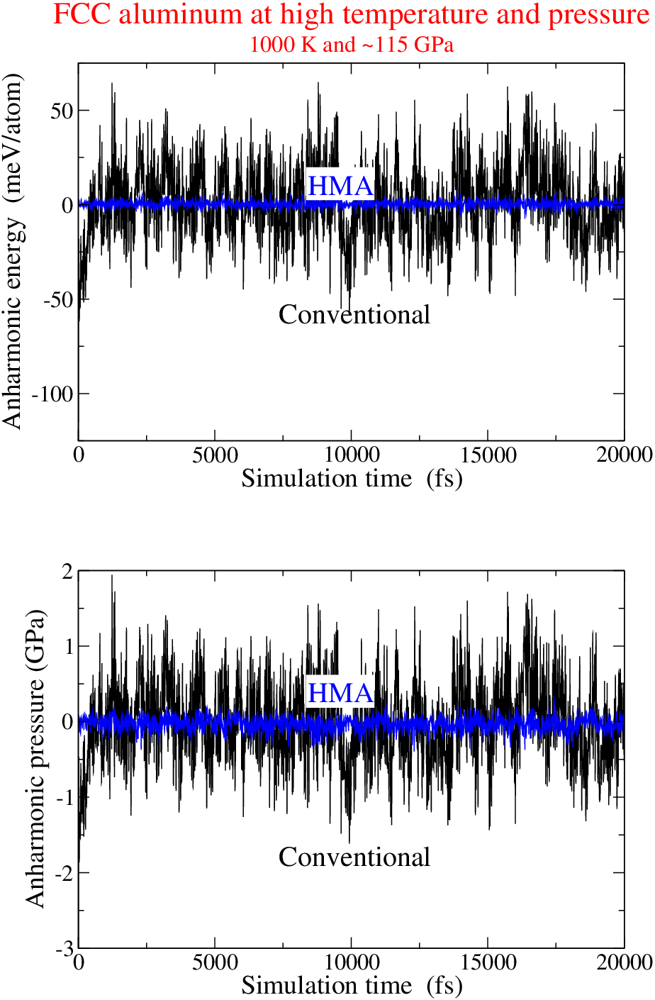

############################################
Welcome to the Mapped-Averaging project
############################################
This project is a Python implementation of the `Mapped-Averaging`_ method for precise estimation of ensemble averages using molecular simulation.

.. toctree::
   :maxdepth: 2

   theory
   applications
   pyhma 

Indices and tables
===================

* :ref:`genindex`
* :ref:`modindex`
* :ref:`search`

.. _Mapped-Averaging: https://pubs.acs.org/doi/abs/10.1021/acs.jctc.6b00018
