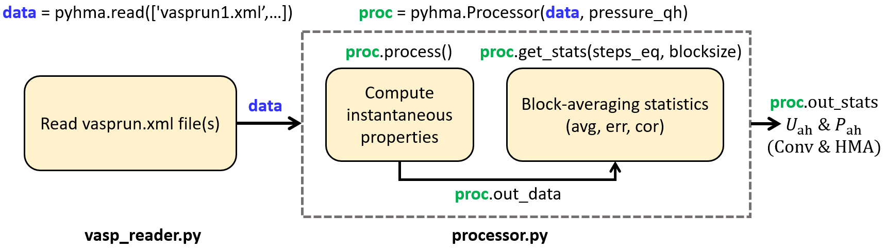

.. _pyhma_structure:

###########
Structure
###########

.. _pyhma_fig:

As shown in the diagram, ``pyHMA`` postprocesses VASP AIMD data in two stages: first, reading ``vasprun.xml`` output file(s) (`vasp_reader.py`_ module), and then process the data to get conventional (Conv) and HMA estimates of anharmonic properties (`processor.py`_ module).

.. automodule:: pyhma.vasp_reader
   :members:

.. automodule:: pyhma.processor
   :members:

.. _vasp_reader.py: https://github.com/etomica/mapped-averaging/tree/master/pyhma-0.0.2/pyhma/vasp_reader.py

.. _processor.py: https://github.com/etomica/mapped-averaging/tree/master/pyhma-0.0.2/pyhma/processor.py

