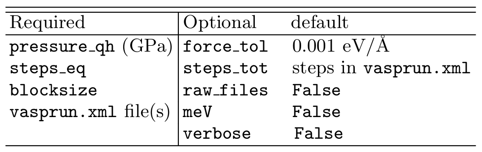

.. _pyhma_usage:

##########
Usage
##########

The ``pyHMA`` package can be used either interactively using Python interpreter, or from command line using ``pyhma`` script.

interactively
===============
.. code-block:: python

   >>> import pyhma 
   >>> # Read 'vasprun.xml' files and save them to 'data' dictionary.
   >>> # Optional args defaults: force_tol=0.001 (eV/A), raw_files=False and verbose=False.
   >>> # raw_files=True makes: poscar_eq.dat, posfor.dat, energy.dat, and pressure_vir.dat.
   >>> data = pyhma.read(['vasprun-1.xml', 'vasprun-2.xml'], force_tol=0.002, raw_files=True, verbose=False) 
   >>> # data.keys() = dict_keys(['box_row_vecs', 'num_atoms', 'volume_atom', 'basis', 'positions', 'forces',
   >>> #                         'energies', 'pressures_vir', 'timestep', 'temperature'])
   >>> # Create Processor object to analyze the data.
   >>> # Optional arg default: meV=False (i.e., energy is given in eV).
   >>> # 'pressure_qh' is a required quasiharmonic pressure (GPa) for HMA pressure.
   >>> proc = pyhma.Processor(data, pressure_qh=4.94154, meV=True) 
   >>> # Compute instantaneous anharmonic energy and pressure (using Conv and HMA methods).
   >>> # Optional args defaults: verbose=False and steps_tot = MD steps from 'vasprun.xml'.
   >>> proc.run(steps_tot=10000, verbose=True) 

   Simulation data
   =================
    Set temperature       (K): 1000.00000
    Volume         (A^3/atom):   10.00000
    MD timestep          (fs):    2.00000
    Lattice energy  (eV/atom):   -2.21324
    Harmonic energy (eV/atom):    0.12522
    Lattice pressure    (GPa):  114.44281
    Harmonic pressure   (GPa):    4.94154

    Found 10000  total MD steps
    Using 10000  user-set MD steps

    Computing instantaneous properties ...

   >>> # Perform block averaging statistics on the production steps (steps_tot - steps_eq).
   >>> # Optional arg default: verbose=False
   >>> stats = proc.get_stats(steps_eq=2000, blocksize=160, verbose=True)

   Block averaging statistics
   ==========================
    8000 production steps (after 2000 equilibaration steps)
    50 blocks (blocksize = 160  steps)

    Computing statistics ...

   >>> # Print anharmonic energy and pressure (using Conv and HMA methods).
   >>> proc.print_stats(stats) 

    e_ah_conv (meV/atom):    1.56537 +/- 1.4e+00    cor:  0.19
    e_ah_hma  (meV/atom):    0.41511 +/- 4.5e-02    cor: -0.08
    p_ah_conv      (GPa):    0.00064 +/- 3.8e-02    cor:  0.19
    p_ah_hma       (GPa):   -0.03207 +/- 5.0e-03    cor:  0.02

using ``pyhma`` script
========================
.. code-block:: bash

   # Usage:
   # pyhma --pressure_qh=qh pressure (GPa) --steps_eq=equilib. steps --blocksize=block size 
   #      [--steps_tot=used steps] [--force_tol=force tolerance] [--raw_files|-r] [--meV] 
   #      [--verbose|-v] vasprun-1.xml vasprun-2.xml ...
   $ pyhma --pressure_qh=4.94154 --steps_eq=2000 --blocksize=160 --steps_tot=10000 -r --meV
             vasprun-1.xml  vasprun-2.xml

     e_ah_conv (meV/atom):    1.56537 +/- 1.4e+00    cor:  0.19
     e_ah_hma  (meV/atom):    0.41511 +/- 4.5e-02    cor: -0.08
     p_ah_conv      (GPa):    0.00064 +/- 3.8e-02    cor:  0.19
     p_ah_hma       (GPa):   -0.03207 +/- 5.0e-03    cor:  0.02

.. _pyhma_tab:

   Summary of arguments used by pyHMA methods or script.

:numref:`Figure %s <pyhma_tab>` shows the ...

.. warning::

   The configuration of the first molecular simulation step must be the one with minimized energy (i.e., zero force on each).

.. note::

   The "err" is the stochastic uncertainty in the average using one standard deviation (:math:`\sigma`) and "corr" is the autocorrelation between adjacent blocks. Note that some correlations from this example are substaintial due to using short blocksize (we only have 2000 steps); hence, we have low quality statistics (inaccurate uncertainities). However, for production results correlations must be as small as possible (:math:`\lesssim 0.2`) and uncertainities can be corrected for correlations using `Kolafa's correction formula <https://www.tandfonline.com/doi/abs/10.1080/00268978600102561>`_.

