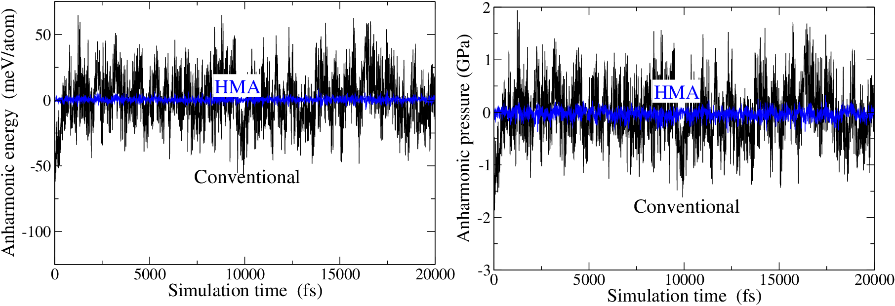
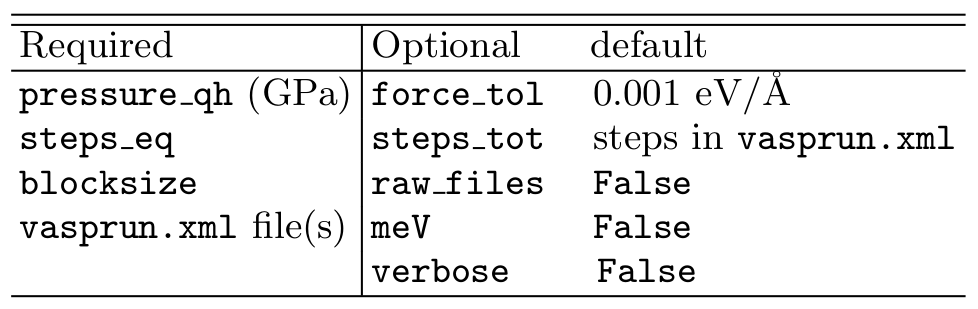

.. _pyhma_structure:

###########
Usage
###########

.. _pyhma_fig:
.. figure:: pyhma_fig.png
   :align: center

   Overall structure of ``pyHMA`` package.   

As shown in the diagram, ``pyHMA`` post-processes VASP AIMD data in two stages: first, reading ``vasprun.xml`` output file(s) (:py:mod:`pyhma.vasp_reader` module), and then process the data to compute anharmonic properties, using conventional (Conv) and harmonically-mapped averaging (HMA) approaches (:py:mod:`pyhma.processor` module).
Below is a detailed description of each stage along with an example of fcc aluminum at high pressure (:math:`P_{\rm lat}=114.4` GPa; corresponds to :math:`V=10 A^3`/atom) and temperature (:math:`1000` K).

.. attention::
    1. It is worth emphasizing here that :math:`U_{\rm lat}` , :math:`P_{\rm lat}` , and :math:`P_{\rm qh}` inputs needed for the anharmonic calculations (see :numref:`Table %s <pyhma_eqs>`) must be obtained using the same setting with with AIMD (e.g., system size, DFT parameters, etc.) in order to ensure having the same potential-energy surface.  
    2. However, lattice and quasiharmonic contributions needed for computing the full property (lat+qh+ah) should be obtained from separate calculations as those components can converge at a different rates from the anharmonic one. The full property :math:`X` can be then decomposed to :math:`X = X^{*}_{\rm lat} + X^{*}_{\rm qh} + X_{\rm ah}`, where the asterisk refers to using different DFT setting.
    3. To summarize points 1 and 2 above: :math:`X_{\rm lat}` and :math:`X_{\rm qh}` used as inputs to ``pyHMA`` should not be used as the lat and qh contributions of the full property. On the other hand, :math:`X^{*}_{\rm lat}` and :math:`X^{*}_{\rm qh}` used for computing the full property should not be used as the lat and qh input parameters for ``pyHMA``. Mixing between these two uses will result in inconsistent and inaccurate results.

1. Interactive usage
-----------------------

**Reading**

In this stage, :py:func:`pyhma.vasp_reader.read()` function parses ``vasprun.xml`` AIMD simulation file and returns a ``data`` dictionary with simulation information to be processed in the second stage.
In the below example, the AIMD simulation consists of two consecutive runs of the same simulation, where the initial configuration of the first run is the fcc lattice positions.

.. code-block:: python

  >>> import pyhma 
  >>> data = pyhma.read(['vasprun-1.xml', 'vasprun-2.xml']) 

The ``data`` dictionary contains the following keys:

  - **box_row_vecs** (Å): box edge row vectors
  - **num_atoms**: total number of atoms
  - **volume_atom** (Å^3/atom): average volume per atom
  - **basis**: list of atomic fractional positions of first configuration
  - **position**: instantaneous atomic fractional positions
  - **force** (eV/Å): instantaneous atomic forces
  - **energy** (eV/atom): instantaneous potential energy (E0) 
  - **pressure** (GPa): instantaneous pressure
  - **pressure_ig** (GPa):  ideal gas pressure
  - **timestep** (fs): MD timestep
  - **temperature** (K):  NVT set temperature

This function also takes optional arguments: *raw_files*, *force_tol*, and *verbose*. By setting ``raw_files=True`` (default is ``False``), the following ``.dat`` files will be generated, which contain raw data from ``vasprun.xml`` file(s). These files are only for diagnostics purposes, and not used in the process stage.

  * **poscar_eq.dat**: initial (must be the equilibrium) POSCAR file (in fractional coordinates)
  * **energy.dat**: instantaneous potential energy, E0 (in eV/atom)
  * **pressure.dat**: instantaneous pressure (in GPa)
  * **posfor.dat**: instantaneous atomic positions and forces (in Å and eV/Å)

The second argument (``force_tol``) is the maximum force allowed on any atom in the initial configuration (default is 0.001 eV/Å). This is used to make sure the initial configuration is the minimized (or, equilibrium). If this condition is not matched, the function will be interrupted and prints a warning with a list of atoms having large initial forces.

To print the lattice vectors, and the initial atomic positions and forces, you can add ``verbose=True`` (default is ``False``) to the arguments. 

Below is the output resulted from using all optional arguments: 

.. code-block:: python

  >>> data = pyhma.read(['vasprun-1.xml', 'vasprun-2.xml'], raw_files=True, force_tol=0.002, verbose=True) 

  Reading vasprun-1.xml vasprun-2.xml
  ==============================================
   first configuration data from vasprun-1.xml
   ----------------------------------------------
   32 atoms (total)
   Box edge (row) vectors
    6.83990379   0.00000000   0.00000000 
    0.00000000   6.83990379   0.00000000 
    0.00000000   0.00000000   6.83990379 

   atom       xyz (direct) coordinates (A)                   xyz forces (eV/A)
     1    0.00000000   0.00000000   0.00000000      0.00000098   0.00000047  -0.00000207
     2    0.50000000   0.00000000   0.00000000     -0.00000114  -0.00000068  -0.00000010
     3    0.00000000   0.50000000   0.00000000      0.00000092  -0.00000001   0.00000009
     4    0.50000000   0.50000000   0.00000000     -0.00000075   0.00000133   0.00000002
     5    0.00000000   0.00000000   0.50000000      0.00000156  -0.00000124   0.00000148
     6    0.50000000   0.00000000   0.50000000     -0.00000228  -0.00000113   0.00000060
     7    0.00000000   0.50000000   0.50000000      0.00000058   0.00000088  -0.00000025
     8    0.50000000   0.50000000   0.50000000     -0.00000022   0.00000147   0.00000020
     9    0.25000000   0.25000000   0.00000000      0.00000626   0.00000445   0.00000093
    10    0.75000000   0.25000000   0.00000000     -0.00000698   0.00000368  -0.00000093
    11    0.25000000   0.75000000   0.00000000      0.00000876  -0.00000401  -0.00000012
    12    0.75000000   0.75000000   0.00000000     -0.00000828  -0.00000414  -0.00000230
    13    0.25000000   0.25000000   0.50000000      0.00000749   0.00000298  -0.00000160
    14    0.75000000   0.25000000   0.50000000     -0.00000890   0.00000465   0.00000053
    15    0.25000000   0.75000000   0.50000000      0.00000879  -0.00000420   0.00000048
    16    0.75000000   0.75000000   0.50000000     -0.00000810  -0.00000479   0.00000260
    17    0.00000000   0.25000000   0.25000000      0.00000300   0.00000494   0.00000561
    18    0.50000000   0.25000000   0.25000000     -0.00000351   0.00000432   0.00000600
    19    0.00000000   0.75000000   0.25000000      0.00000149  -0.00000550   0.00000703
    20    0.50000000   0.75000000   0.25000000     -0.00000171  -0.00000398   0.00000669
    21    0.00000000   0.25000000   0.75000000      0.00000072   0.00000397  -0.00000567
    22    0.50000000   0.25000000   0.75000000     -0.00000041   0.00000300  -0.00000674
    23    0.00000000   0.75000000   0.75000000     -0.00000135  -0.00000323  -0.00000732
    24    0.50000000   0.75000000   0.75000000      0.00000067  -0.00000412  -0.00000650
    25    0.25000000   0.00000000   0.25000000      0.00000892   0.00000095   0.00000758
    26    0.75000000   0.00000000   0.25000000     -0.00000866  -0.00000109   0.00000571
    27    0.25000000   0.50000000   0.25000000      0.00000780  -0.00000037   0.00000582
    28    0.75000000   0.50000000   0.25000000     -0.00000778   0.00000087   0.00000677
    29    0.25000000   0.00000000   0.75000000      0.00000777  -0.00000093  -0.00000665
    30    0.75000000   0.00000000   0.75000000     -0.00000764  -0.00000253  -0.00000547
    31    0.25000000   0.50000000   0.75000000      0.00000795   0.00000070  -0.00000629
    32    0.75000000   0.50000000   0.75000000     -0.00000705   0.00000248  -0.00000653

    Reading vasprun-1.xml  ( 1 out of 2 )
    Reading vasprun-2.xml  ( 2 out of 2 )
  >>> 

.. note::
  * The read() function can handle incomplete vasprun.xml file(s) generated from interrupted AIMD runs (by the user, or due to some time constraint). The was possible with using the recovery option of LXML parser. 
  * If your MD simulation starts from a thermalized/equilibrated (not lattice) configuration, you can just run a single-point energy calculation on the lattice configuration (using the same DFT parameters used with AIMD) and use the output as your ``vasprun-1.xml`` input to pyHMA, followed by your thermalized ``vasprun.xml`` files.

**Processing**

In this stage, the ``data`` from previous step are processed to compute anharmonic properties. This is done, first, by creating a processor instance (``proc``) of the :py:class:`pyhma.processor.Processor()` class, using the ``data`` dictionary and the quasiharmonic pressure (GPa) at the given :math:`V` and :math:`T`. The class takes one optional argument, ``meV``, to specify whether to report the energy results in meV (``meV=True``) or eV (``meV=False``, default). At this point, the ``proc`` object carries the same information exist in the ``data`` dictionary.
 
.. code-block:: python

   >>> proc = pyhma.Processor(data, pressure_qh=4.94154, meV=True) 

Then, the instantaneous properties are obtained by calling the :py:meth:`pyhma.processor.Processor.process` method, which takes two optional arguments: ``steps_tot`` and ``verbose``. The ``steps_tot`` is the total number of MD steps to be used for ensemble averages (default is all steps found in ``vasprun.xml``) and the ``verbose`` (default is False) directs ``pyHMA`` to print information while running.
The output is saved to a 2D array (``proc.out_data`` attribute) of length equal to all MD steps (or, ``steps_tot`` if set) and contains four columns: Conv and HMA anharmonic energies and pressures. 

.. code-block:: python

  >>> proc.process(steps_tot=10000, verbose=True)

     Simulation data
     ===============
      Set temperature       (K): 1000.00000
      Volume         (A^3/atom):   10.00000
      MD timestep          (fs):    2.00000
      Lattice energy  (eV/atom):   -2.21324
      Harmonic energy (eV/atom):    0.12522
      Lattice pressure    (GPa):  114.44281
      Harmonic pressure   (GPa):    4.94525

      Found 11036  total MD steps
      Using 10000  user-set MD steps

      Computing instantaneous properties ...

The method also generates ``energy_ah.out`` and ``pressure_ah.out`` output files for the instantaneous anharmonic energy (eV/atom; or meV/atom if meV=True) and pressure (GPa), respectively. Each file contains three columns; time (in fs), Conv, and HMA estimates of the property. This data is plotted below.

   Time vartaion of the anharmonic energy (``energy_ah.out``) and pressure (``pressure_ah.out``).

Lastly, ensemble  statistics (average, uncertainty, and block correlation) are obtained using block averaging technique. This is done by invoking the :py:meth:`pyhma.processor.Processor.get_stats` method, which takes two required arguments (``steps_eq`` and ``blocksize``) and one optional argument (``verbose``). The ``steps_eq`` is the number of MD steps used for equilibaration and ``blocksize`` is the number of MD steps in each block used for block averaging; so, ``steps_tot``/``blocksize`` is the number of blocks to be used. If True, the verbose flag will direct ``pyHMA`` to print samples information. 

The method returns the statistics output in a form of a dictionary (``stats``) of four entries: Conv and HMA anharmonic energies (``e_ah_conv`` and ``e_ah_hma``) and pressures (``p_ah_conv`` and ``p_ah_hma``), each with three elements of average (avg), uncertainty (err), and adjacent blocks correlation (cor). 
The output can be presented in a more user-friendly format by using :py:meth:`pyhma.processor.Processor.print_stats` method, which yields the output shown below.

.. code-block:: python

   >>> stats = proc.get_stats(steps_eq=1000, blocksize=90, verbose=True)

   Block averaging statistics
   ==========================
    9000 production steps (after 1000 equilibration steps)
    100 blocks (blocksize = 90  steps)

    Computing statistics ...

   >>> proc.print_stats(stats)

    e_ah_conv (meV/atom):    2.10911 +/- 1.1e+00    cor: 0.35
    e_ah_hma  (meV/atom):    0.42650 +/- 4.3e-02    cor: 0.11
    p_ah_conv      (GPa):    0.01371 +/- 3.1e-02    cor: 0.36
    p_ah_hma       (GPa):   -0.03419 +/- 4.1e-03    cor: 0.26

.. note::
    * The correlation should be as small as possible (less than :math:`\lessapprox 0.2`) to ensure accurate estimate of uncertainty. Although increasing the ``blocksize`` reduces the correlations, the number of blocks should be large enough (:math:`\gtrapprox 50`) to yield meaningful statistics.
    * The Conv and HMA should be statistically consistent, as long as the results are converged with respect to timestep. However, the above example has inconsistent results due to using relatively large timestep (:math:`\Delta t=2` fs), though the HMA estimate is still accurate as it converges faster than Conv (see our `JCP2018 <https://doi.org/10.1063/1.5043614>`_ work for details). 

2. pyhma script
----------------
Anharmonic properties can be computed in one step from the command-line using ``pyhma`` script, which uses the same arguments as those used above, except for the use of ``r`` and ``v`` short forms of ``raw_files`` and ``verbose`` options, respectively. The usage of ``pyhma`` is given here, where the square brackets represent optional keys:: 

    $ # Usage: 
    $ # pyhma --pressure_qh=qh pressure (GPa) --steps_eq=equilib. steps --blocksize=block size 
    $ #      [--steps_tot=used steps] [--force_tol=force tolerance] [--raw_files|-r] [--meV] 
    $ #      [--verbose|-v] vasprun-1.xml vasprun-2.xml ...

Using the ``pyhma`` script (with default option) to compute anharmonic energy and pressure of the above fcc aluminum example yields::

    $ pyhma --pressure_qh=4.94525 --steps_eq=1000 --steps_tot=10000 --blocksize=90  -r --meV
            vasprun-1.xml  vasprun-2.xml

      e_ah_conv (meV/atom):    2.10911 +/- 1.1e+00    cor: 0.35
      e_ah_hma  (meV/atom):    0.42650 +/- 4.3e-02    cor: 0.11
      p_ah_conv      (GPa):    0.01371 +/- 3.1e-02    cor: 0.36
      p_ah_hma       (GPa):   -0.03419 +/- 4.1e-03    cor: 0.26

3. Parameters table
--------------------

The Table below gives a summary of both required and optional arguments used by ``pyHMA``.

.. _parameters_tab:

